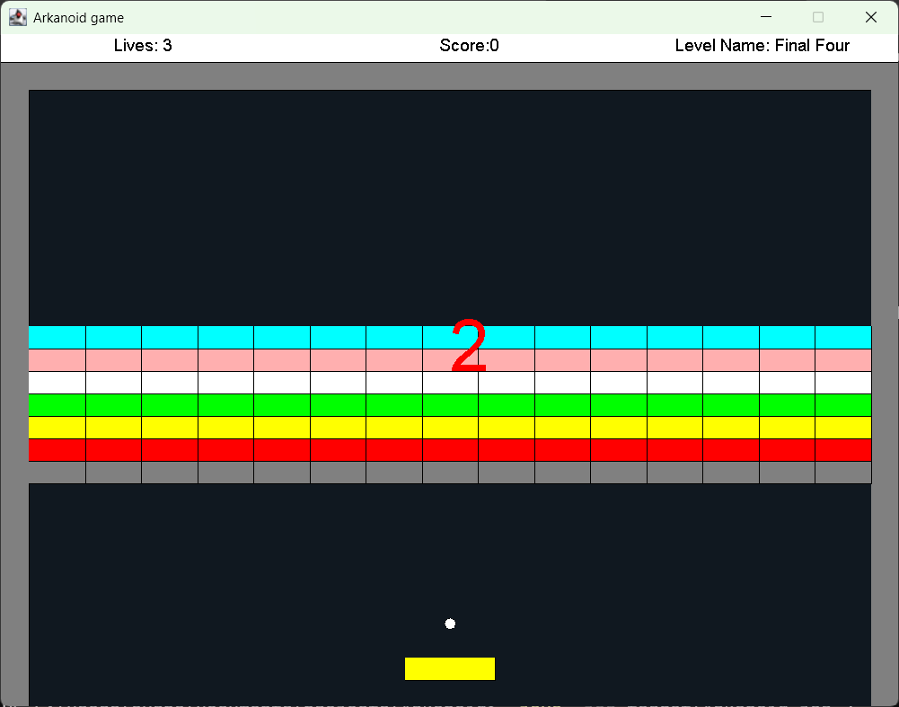
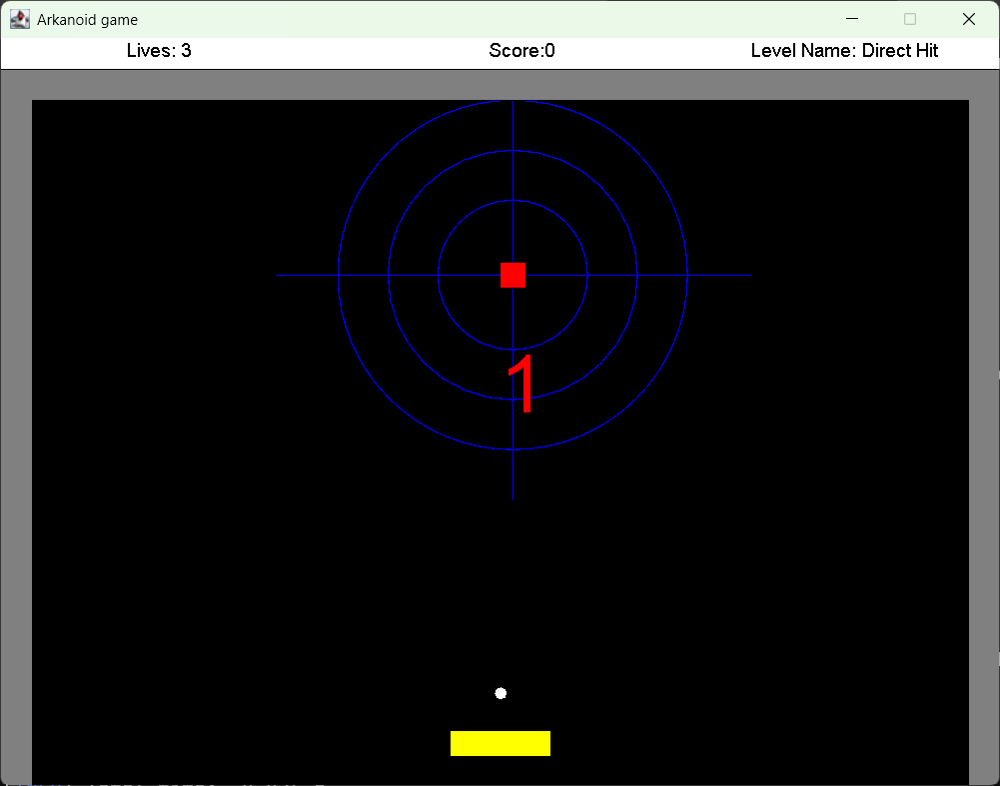
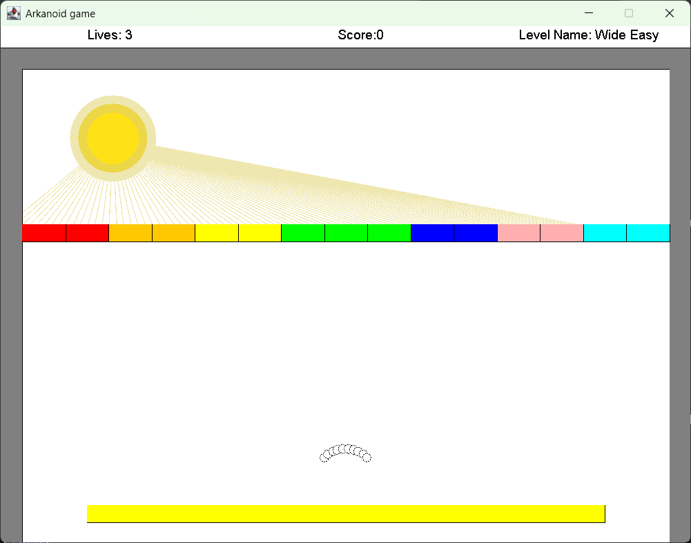
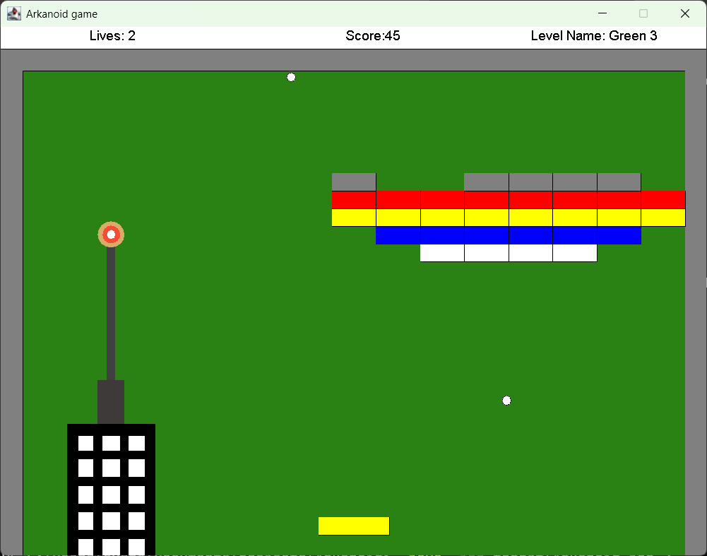
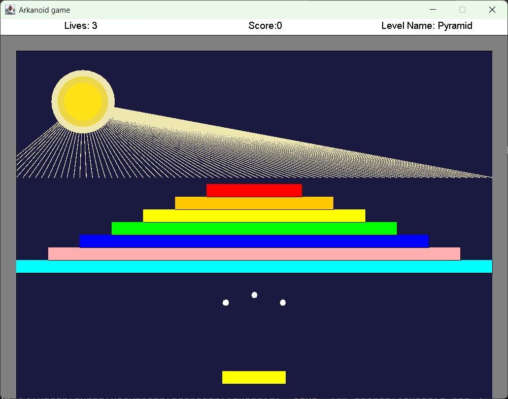
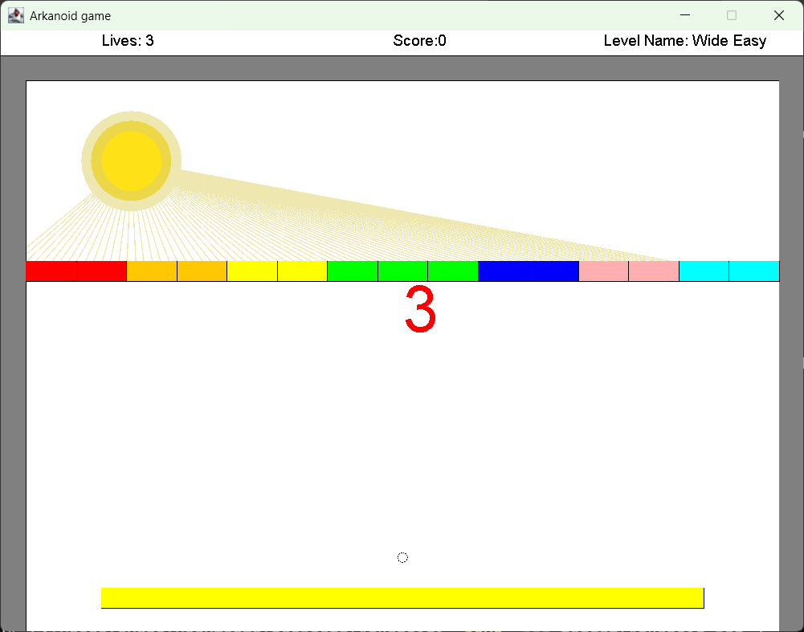
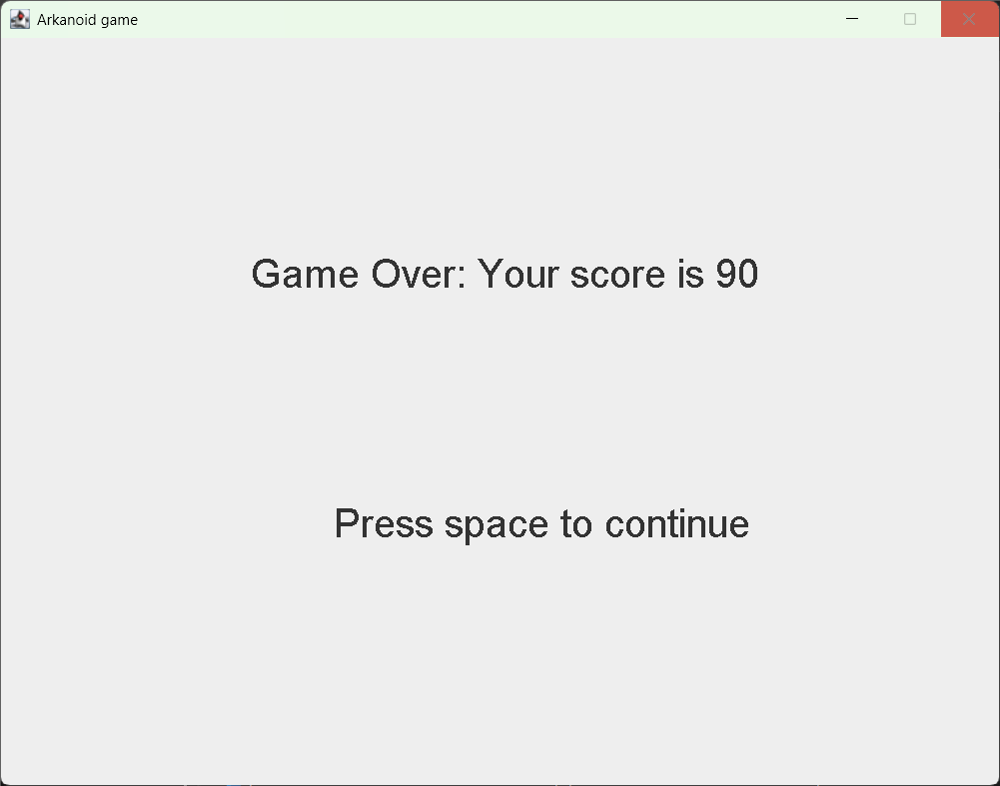
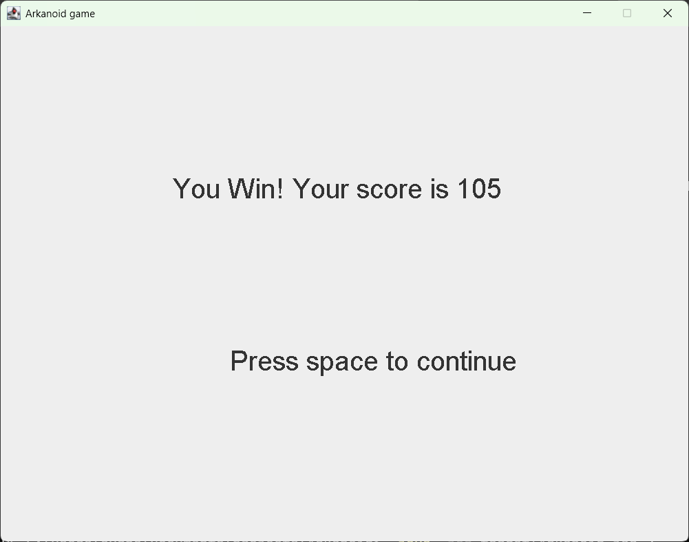

# Arkanoid

A desktop clone of the arcade game Arkanoid — a ball, a paddle, five levels of
breakable blocks — built in Java on the `biuoop` teaching GUI toolkit. Its
defining engineering property is a **trajectory-based collision model**: each
frame the ball is tested against every collidable along the line it is about to
travel, not only where it lands, so a fast ball resolves against the first block
in its path instead of passing through it between frames.

Originally a Bar-Ilan OOP assignment; hardened into a portfolio project with a
Maven build, CI, a characterization-test safety net around the legacy physics,
and a real losable end state.

> [Arkanoid](https://en.wikipedia.org/wiki/Arkanoid) is a 1986 block breaker
> video game developed and published by Taito for arcades. The player controls
> the Vaus, a paddle-shaped craft, deflecting a ball to break brick formations
> without letting it fall past the bottom edge.
> — [Wikipedia](https://en.wikipedia.org/wiki/Arkanoid)

This clone keeps the core loop (paddle, ball, breakable blocks, per-level
layouts) and leaves out the power-ups, enemies, and the DOH boss fight.



---

## The problem

A block-breaker looks trivial and hides two real problems:

1. **Collision without tunnelling.** At 60 fps a ball moving several pixels per
   frame can pass clean through a block between two frames if you only test for
   overlap after moving. The fix has to look *ahead*.
2. **Open-ended content.** "Add a level" should not mean touching the game loop,
   the renderer, or the collision code. Levels have to be pure data behind one
   interface.

Plus the thing the original assignment got wrong: the game **could not be
lost** — losing every ball silently re-initialised the level and looped
forever. There was a Game Over screen that was never an end state.

---

## System architecture & flow

Everything drawn is a **`Sprite`** (`drawOn` + `timePassed`). Things a ball can
collide with are also **`Collidable`** (`getCollisionRectangle` + `hit`).
`GameLevel` keeps one registry of each and walks both every frame.

```
                 ArkanoidGame.main
                   parses level args → List<LevelInformation>
                        │
                        ▼
   ┌──────────────  GameFlow.runLevels  ──────────────┐
   │  owns shared Counters: score, lives (start 3)    │
   │  for each level:  new GameLevel(...)             │
   │     loop:  TurnResult r = level.run()            │
   │        LEVEL_CLEARED → next level                │
   │        TURN_LOST     → lives-- ;  0 → Game Over  │
   └────────────────────────┬────────────────────────┘
                            │
                            ▼
        GameLevel (implements Animation)          AnimationRunner
        ┌───────────────────────────────┐        drives any Animation
        │ SpriteCollection   (draw/tick)│◀──────  at 60 fps: while(!stop)
        │ GameEnvironment    (collisions)│        { doOneFrame; show; sleep }
        └───────────────────────────────┘
                     ▲          │  per frame, per ball
                     │          ▼
   Ball.moveOneStep ─┴─▶ GameEnvironment.getClosestCollision(trajectory)
        move freely, or snap to hit point and ask Collidable.hit(...) for a
        new Velocity.  Block.hit() also notifies its HitListeners.
                                   │
              ┌────────────────────┼─────────────────────┐
              ▼                    ▼                     ▼
        BlockRemover        ScoreTrackingListener     BallRemover
        block off the       score += points           ball off the
        level + counter--                             level + counter--
```

### One frame, end to end

1. `AnimationRunner.run(gameLevel)` calls `doOneFrame(surface)` and targets a
   ~16 ms budget, sleeping off the remainder.
2. `doOneFrame` checks the win/lose counters, then calls `drawAllOn` +
   `notifyAllTimePassed` on the sprite registry.
3. Each `Ball.timePassed` → `moveOneStep`: build the trajectory line from the
   current centre to the next, hand it to
   `GameEnvironment.getClosestCollision`.
4. **No hit** → move to the trajectory end. **Hit** → move to just before the
   collision point and call `collidable.hit(ball, point, velocity)`, which
   returns the reflected velocity.
5. `Block.hit` additionally fires `notifyHit` → every registered `HitListener`:
   `BlockRemover` pulls the block and decrements the remaining-blocks counter,
   `ScoreTrackingListener` adds points, `BallRemover` (on the bottom wall)
   pulls the ball.
6. When remaining blocks hit zero, `doOneFrame` sets `cleared = true` and stops
   the turn; `run()` returns `LEVEL_CLEARED`. When remaining balls hit zero it
   stops the turn and returns `TURN_LOST`.
7. `GameFlow` acts on the `TurnResult`: next level, or `lives--` and re-serve,
   or — at zero lives — the Game Over screen followed by a clean process exit.

---

## Tech stack & engineering decisions

| Layer | Technology | Rationale & trade-offs |
|---|---|---|
| Language | Java 17 (LTS) | Pinned via `maven.compiler.release=17` so the bytecode target can't drift from the source level. The original code shipped an arrow-`switch` (Java 14+) while the README claimed "Java SE 10" — that mismatch is what the pin removes. |
| GUI | `biuoop` 1.4 | Course-supplied toolkit — window, draw surface, keyboard sensor, frame sleeper. Not on Maven Central and no license to redistribute broadly, so it is **vendored** (see below). Trade-off: no modern rendering, but the assignment's whole point was to build the game loop by hand. |
| Build | Maven + `maven-shade-plugin` | One `mvn package` produces a runnable fat jar with `biuoop` bundled — `java -jar` with no classpath setup. Shade over the assembly plugin for the cleaner manifest transformer. |
| Dependency hosting | In-project file repository (`maven-repo/`) | `biuoop` is committed as a proper Maven artifact under `maven-repo/ac/biu/oop/…` with a hand-written 5-element POM. The POM embedded in the upstream jar names an unresolvable `ac.biu.oop:root` parent and cannot be used. Alternative (`system` scope + a checked-in path) breaks the shade plugin — it won't bundle a system-scoped jar. |
| Tests | JUnit 5 + `maven-surefire-plugin` | 30 characterization tests over the GUI-free core (geometry, velocity, counter). Run headless (`-Djava.awt.headless=true`) so CI needs no display. |
| Static analysis | `maven-checkstyle-plugin` + the course ruleset | Wired into `verify` but **`failOnViolation=false`**: the ruleset flags known, accepted legacy patterns (float-tolerant `equals` without `hashCode` on a mutable `Point`). A portfolio clone must still build; the console output still surfaces every violation. Currently: **0 violations**. |
| CI | GitHub Actions | `verify` (compile + checkstyle + tests) on every push and PR, on a clean Ubuntu runner via the Maven Wrapper — proves the build has no undeclared local dependency. Uploads the jar as an artifact. |

---

## Design trade-offs worth calling out

- **Vendored GUI jar, not a submodule or install step.** A fresh `git clone`
  builds with nothing but a JDK and the wrapper. The cost is ~20 KB of binary
  in the repo and a hand-maintained POM.
- **Flat `src/main/java` with no root package.** The classes are single-word
  (`Ball`, `Paddle`, `GameLevel`) under topic packages (`geometry`, `sprite`,
  `collidable`, …) but there is no `com.example` namespace. Kept as-is: it
  matches the assignment and the package split already gives the boundaries.
- **The geometry core is fenced.** `Ball.moveOneStep` (four-way velocity-sign
  branching, epsilon fudging, an escape-the-block `while` loop) is load-bearing,
  epsilon-sensitive, and was shipped without tests. It is **not refactored** —
  instead, the 30 characterization tests pin the primitives it is built from
  (`Point`, `Line` intersection math, `Rectangle`, `Velocity`), including two
  known quirks (`Line`'s collinear-overlap intersection returns `null`;
  `Rectangle.isPointInList` has an inverted name). `moveOneStep` itself has no
  direct test yet — writing one is the prerequisite for touching it.
- **`geometry/` uses an upward-Y convention.** A rectangle's lower edge is
  `upperLeft.y - height`. Consistent everywhere; `Block.drawOn` maps it back to
  screen space. Not a bug — do not "fix" it.

---

## Resilience & correctness patterns

- **Look-ahead collision.** `GameEnvironment.getClosestCollision` takes the
  ball's trajectory line and returns the *nearest* intersection across all
  collidables, so a fast ball snaps to the first block it would have crossed
  rather than tunnelling or resolving a stale overlap.
- **Hits are events, not a switchboard.** `Block implements HitNotifier`; on a
  hit it notifies its `HitListener`s. Block removal, ball removal at the bottom
  wall, and scoring are three independent listeners — adding a fourth behaviour
  touches nothing existing. `notifyHit` iterates a copy of the listener list so
  a listener can remove itself mid-notification without a `ConcurrentModification`.
- **Real end state.** `GameLevel.run()` returns a `TurnResult` enum computed
  from a `cleared` flag reset at the top of each turn. `GameFlow` owns a shared
  lives `Counter` (start 3): `TURN_LOST` decrements it; at zero it shows Game
  Over and `return`s, so `main` reaches `gui.close()` and the process ends. The
  original code re-initialised the level on ball-loss with no exit at all — the
  turn-retry loop now always terminates, on `LEVEL_CLEARED` or at zero lives.
- **Characterization tests as a safety net.** The 30 tests exist to make the
  fenced geometry *safe to change later*, not to prove it correct now.
- **CI proves the build is self-contained.** The Actions run builds from a cold
  Ubuntu runner with only the wrapper — if anything depended on a jar living on
  the author's machine, CI would be red.

---

## Project layout

```
Arkanoid/
├── src/main/java/
│   ├── ArkanoidGame.java        entry point — parses level args, builds the level list
│   ├── game/                    GameFlow (score/lives + level sequence), GameLevel (one
│   │                            level's registries + frame loop), GameEnvironment
│   │                            (collision broker), TurnResult
│   ├── sprite/                  Ball, Background, SpriteCollection, the HUD indicators
│   ├── collidable/              Paddle, Block, Velocity, Collidable, CollisionInfo
│   ├── level/                   LevelInformation (the extension point) + 5 level classes
│   ├── listener/                HitListener/HitNotifier observer: BlockRemover,
│   │                            BallRemover, ScoreTrackingListener, Counter
│   ├── animation/               Animation interface + AnimationRunner (60 fps driver),
│   │                            countdown / pause / end screens, background decorators
│   └── geometry/                Point, Line, Rectangle — pure math, covered by characterization tests
├── src/test/java/               JUnit 5 characterization tests (geometry, velocity, counter)
├── maven-repo/                  in-project Maven repository — vendored biuoop-1.4
├── config/checkstyle/           vendored course checkstyle ruleset
├── docs/
│   ├── claims-validation.md     every README/code claim vs. reality
│   ├── design/                  design notes (lives system, added levels)
│   └── img/                     gameplay screenshots
├── .github/workflows/ci.yml     compile + checkstyle + test + package on every push/PR
├── mvnw / mvnw.cmd              Maven Wrapper — no local Maven install needed
└── pom.xml
```

**Adding a level** = one class implementing `LevelInformation` (blocks, ball
velocities, paddle size/speed, background) + one `else if` in `ArkanoidGame`.
Nothing else changes — `FinalFour4Level` and `Pyramid5Level` were added exactly
this way.

---

## Local setup & quickstart

Requires **JDK 17+**. No Maven install needed — the wrapper fetches it.

```bash
git clone https://github.com/Avrhambi/Arkanoid.git
cd Arkanoid

./mvnw verify            # compile + checkstyle (non-blocking) + 30 JUnit tests
./mvnw package           # build target/Arkanoid.jar (fat jar, biuoop bundled)

java -jar target/Arkanoid.jar          # play all five levels
java -jar target/Arkanoid.jar 4 2      # play only those levels, in that order
```

On Windows use `mvnw.cmd` in place of `./mvnw`.

**Controls:** `←` `→` move the paddle · `p` pause · `space` resume / dismiss a
screen.

---

## CI/CD & quality gate

[`.github/workflows/ci.yml`](.github/workflows/ci.yml) is configured to run on
every push to `main` and every pull request:

| Step | What it enforces |
|---|---|
| `./mvnw -B -ntp verify` | source compiles at Java 17; all 30 tests pass; checkstyle report generated (non-blocking) |
| artifact upload | `target/Arkanoid.jar` is produced (`if-no-files-found: error`) |

The runner is a clean `ubuntu-latest` with Temurin 17 — no display, no
pre-installed dependencies — so a green run proves the repo builds from nothing.

That exact command has been verified locally from a fresh `git clone` with an
empty `~/.m2` and the wrapper bootstrapping Maven itself: `BUILD SUCCESS`, 30
tests, 0 checkstyle violations, `biuoop` resolved from the in-project
`maven-repo/`. The hosted run is currently blocked by a GitHub account billing
lock (unrelated to this repo); it will execute once that is cleared.

---

## Screenshots

| | | |
|---|---|---|
|  |  |  |
| **Direct Hit** | **Wide Easy** | **Green 3** |
|  |  |  |
| **Final Four** | **Pyramid** | **Countdown** |
|  |  | |
| **Game Over** (0 lives) | **You Win** | |

---

## License

MIT — see [LICENSE](LICENSE). `biuoop-1.4.jar` under `maven-repo/` is a
Bar-Ilan University course library, vendored for build reproducibility and not
covered by this project's license.
